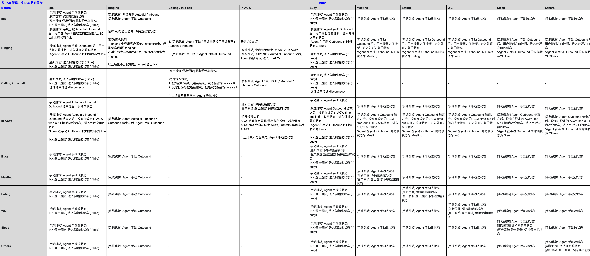

## 嵌入式客户端

#### 概览

NXLink嵌入式客户端是 NXLink 联络中心服务的变体，可以在第三方系统内，也可以作为与任何 Web 应用程序一起使用的浏览器扩展。借助 NXLink Embeddable Framework，您可以开发自己的 NXLink集成。 这些集成支持各种交互类型和功能，例如点击拨号、屏幕弹出等。

#### 用户界面

您可以从客户端访问菜单并更改状态和电话。 该菜单允许您快速执行常见任务，例如接听来电、拨打电话或更改设置。


#### 支持的交互类型

接听来电-与任何其他互动一样，座席在客户端接听呼叫。

外呼拨号-座席可以直接、或使用点击拨号拨打外线电话。

通话记录-坐席可以查询到所有的历史通话记录。

#### 可实现的CRM 功能

点击拨号-点击号码或者发起通话图标即可发起呼叫，按照自定义的集成配置。

交互日志-查询所有座席的详细交互日志。

#### 架构

下图显示了 NXLink嵌入式客户端的所有组件的架构。


#### 开发文档


#### 1. Iframe域名地址，加载方式

https://nxlink.nxcloud.com/admin/#/nxcc

```js
// 创建iframe
// 建议width为256px，height为460px
<iframe id="iframe" allow="camera *; microphone *; autoplay *; hid *" src="https://nxlink.nxcloud.com/admin/#/nxcc"></iframe>
```


#### 2. 静默自动登录

| 字段        | 类型   | 备注                                                         |
| ----------- | ------ | ------------------------------------------------------------ |
| email       | string | 账号（邮箱）                                                 |
| password    | string | 密码                                                         |
| lang        | string | 语言，目前支持中文（zh-CN），英文（en-US），西班牙语（es-MX） |
| loginMethod | number | 0：普通坐席登录（传参登录），1：谷歌 SSO登录（该登录方式下，不需要传email和password，默认跳转sso登录页面）。 |

```js
// loginMethod：0，普通坐席登录
const message = {
    type: 'init',
    content: {
        email：email，
    	password： password，
        lang: "zh-CN",
        loginMethod：0
    }
}
// loginMethod：1，谷歌 SSO登录消息协议
const message = {
    type: 'init',
    content: {
        lang: "zh-CN",
        loginMethod：1
    }
}

// 使用该方法传递给嵌入的iframe
const mapFrame = document.getElementById("iframe")
mapFrame.onload = function() {
	const iframeWin = mapFrame.contentWindow;
	iframeWin.postMessage(message, '*');
}
```

#### 3. 跳转登陆页手动登录

- 未登录：跳转至普通坐席登录
- 已登录：不进行跳转；登出时跳转至普通坐席登录
> SSO登录的请勿调用
 
   ```js
   // 跳转至普通坐席登录	
   const message = {
       type: 'toEmailLogin',
   }

   iframeWin.postMessage(message, '*');
   const mapFrame = document.getElementById("iframe")
   const iframeWin = mapFrame.contentWindow;
   ```

#### 4. Iframe页面相关回调

可使用下述方法接收消息协议，可根据协议上的type区分消息类型

```
window.addEventListener( "message",(event) => {
  // 打印接收到的数据
  consolelog(event.data.type)
},false);
```


1. ##### 账号登入成功消息协议

   登录账号存在坐席时回调传递以下字段，无坐席不传递

   | 字段    | 类型   | 备注       |
   | ------- | ------ | ---------- |
   | email   | string | 登录账号   |
   | sipNum  | string | 话机号     |
   | groupNo | string | 坐席组编号 |

   ```js
   // iframe回调的消息协议
   event.data:{
       type: 'login',
       content: {
         email: '',
         sipNum: '',
         groupNo: ''    
       }
   }
   ```

2. ##### 登录账号是否存在坐席

      | Code（number） | 备注                               |
      | -------------- | ---------------------------------- |
      | 1              | 该账号存在坐席                     |
      | 2              | 该账号不存在坐席或者坐席状态已关闭 |

      ```js
      // iframe回调的消息协议
      event.data:{
          type: 'agentExists',
          content: {
            code: 1
          }
      }
      ```

3. ##### 话机状态和回调消息

   | Code（number） | 坐席话机状态 |
   | -------------- | ------------ |
   | 0              | 呼出振铃中   |
   | 1              | 呼入振铃中   |
   | 2              | 通话中       |
   | 3              | 话机断开     |
   | 4              | 话机注册成功 |
   | 5              | 挂断         |
   | 6              | 账号未登录   |
   | -1             | 话机注册失败 |

   *浏览器多Tab页面表现为同步，当某一tab通话状态变更以后，其他tab的状态会保持一致；如一个tab为通话中，其他tab也同步为通话中

   当话机状态为呼出中(0)、呼入中(1)、通话中(2)、挂断(5)的通话状态时，会返回以下字段

   | 字段                   | 类型         | 备注                                       |
   | ---------------------- | ------------ | ------------------------------------------ |
   | callId                 | string       | 通话 id                                    |
   | direction              | number       | 通话场景，0:呼入，1:呼出，2:自动拨号转人工 |
   | caller                 | string       | 主叫号码                                   |
   | callee                 | string       | 被叫号码                                   |
   | orderId                | string       | 回传的用户自定义id，字符串，32位           |
   | params                 | json string  | 呼出时回传的用户自定义字段，支持json字符串 |
   | callStartTimestamp     | number(毫秒) | 时间戳，当发起呼叫/接收来电时生成          |
   | callConnectedTimestamp | number(毫秒) | 时间戳，当接听电话时生成                   |
   | callHangUpTimestamp    | number(毫秒) | 时间戳，挂断电话后生成                     |
   | other                  | json string  | 呼入时回传的用户自定义字段                 |

   ```js
   // iframe回调的消息协议
   event.data:{
       type: 'dialStatus',
       content: {
         code: 0,
         callId: '',
         orderId: '',
         direction: 1,
         caller: '',
         callee: '',
         params: '',
         callStartTimestamp: '',
         callConnectedTimestamp: '',
         callHangUpTimestamp: ''
       }
   }
   ```

   ###### 挂断原因映射

    | Code | 挂断原因                   |
    | ---- | -------------------------- |
    | 810  | 话机已欠费                 |
    | 811  | 不允许呼叫的国家           |
    | 812  | 号码不正确                 |
    | 813  | 登录信息已过期，请重新登录 |
    | 814  | 呼叫失败（黑名单号码）     |
    | 815  | 呼叫失败（呼叫次数限制）   |
    | 816  | 当前号码无法使用           |
    | 800  | 网络异常                   |
    | 801  | 网络异常                   |
    | 817  | 今日呼叫体验已上限。       |
    | 819  | DID号码呼叫失败。          |


4. ##### 坐席状态

   | code（number） | 备注                                                         |
   | -------------- | ------------------------------------------------------------ |
   | 1              | 工作-示闲，可呼入呼出                                        |
   | 2              | 工作-示忙（发起呼叫/接收来电、通话中、整理中也返回此code），仅能呼出 |
   | 3              | 休息-会议，仅能呼出                                          |
   | 4              | 休息-吃饭，仅能呼出                                          |
   | 5              | 休息-厕所，仅能呼出                                          |
   | 6              | 休息-睡觉，仅能呼出                                          |
   | 7              | 休息-其他，仅能呼出                                          |

   *浏览器多Tab页面表现：当某一tab坐席状态进行变更，切换其他tab以后，状态会保持一致

   ```js
   // iframe回调的消息协议
   event.data:{
       type: 'agentStatus',
       content: {
         code: 1
       }
   }
   ```

5. ##### 登出消息协议

   ```js
   // iframe回调的消息协议
   event.data:{
       type: 'logout'
   }
   ```

6. ##### token失效消息协议

   ```js
   // iframe回调的消息协议
   event.data:{
       type: 'tokenInvalid'
   }
   ```

   

#### 5. 发起呼叫消息协议

| 字段        | 类型       | 备注                                             |
| ----------- | ---------- | ------------------------------------------------ |
| caller      | string(32) | 主叫号码，主叫传空将根据随机号码呼出             |
| callee      | string(32) | 被叫号码，需带国码，例如呼叫香港方向：852******* |
| countryCode | string     | 被叫国码                                         |
| orderId     | string(32) | 自定义orderId，可选填                            |
| params      | string     | 自定义字段，可选填                               |

```js
const message = {
    type: 'callOut',
    content: {
        caller: '',
  		callee: "8524444",
  		countryCode: "852",
  		orderId: "66493f1afaa3",
        params： ""
    }
}

// 使用该方法传递给嵌入的iframe
const mapFrame = document.getElementById("iframe")
const iframeWin = mapFrame.contentWindow;
iframeWin.postMessage(message, '*');
```

#### 6. Proactively log out

```js
// Logout message protocol
const message = {
    type: 'loginOut',
}
   
const mapFrame = document.getElementById("iframe")
const iframeWin = mapFrame.contentWindow;
iframeWin.postMessage(message, '*');
```


#### 7. 状态变更说明

链接：[https://help.nxcloud.com/nxlink/docs/Iframe-duo-zhuang-tai-tiao-zhuan-shuo-ming](https://help.nxcloud.com/nxlink/docs/Iframe-duo-zhuang-tai-tiao-zhuan-shuo-ming)



